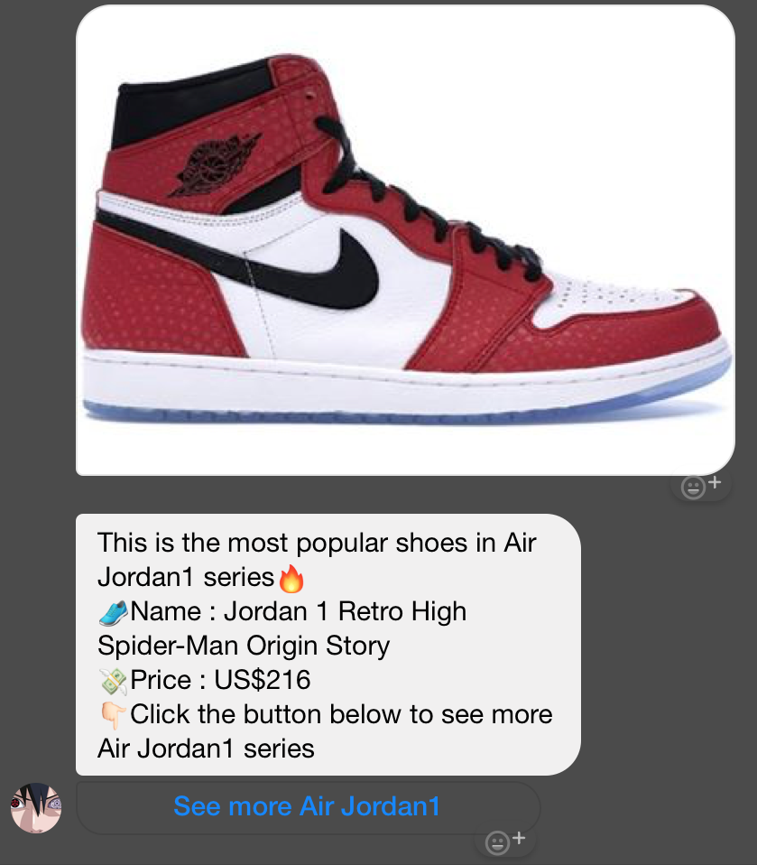
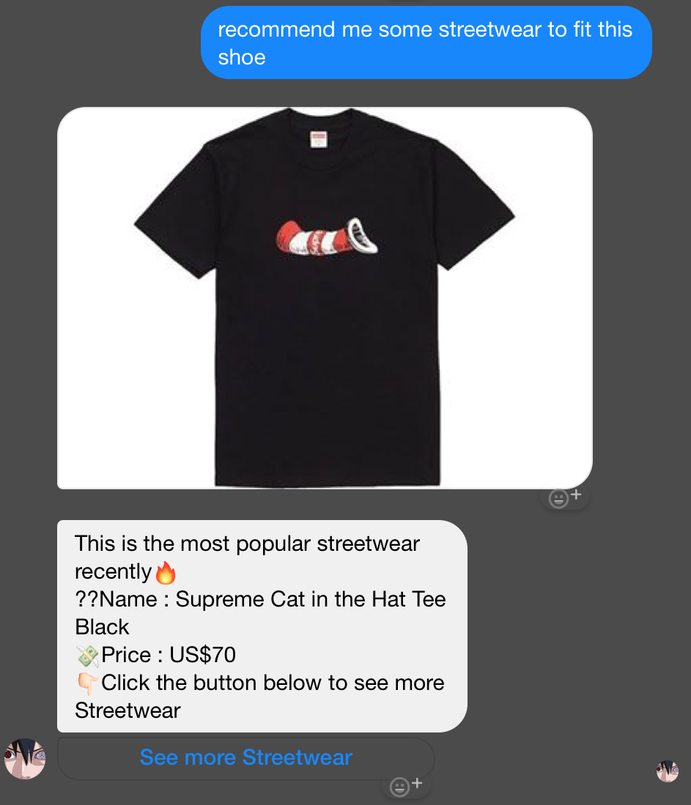

# TOC-ChatBot
Final Program for TOC class

A Facebook messenger bot based on a finite state machine

## Features
### Button
* web_url button
* postback button

### Image
* It can send image of the collection

### Web Crawler
* Use BeautifulSoup to crawl stockX website info

## Finite State Machine

## Usage
The initial state is set to `user`.

Every time `user` state is triggered to `advance` to another state, it will trigger `is_going_to_jordan` or `is_going_to_adidas` or `is_going_to_nike` or `is_going_to_yeezy`.

* `user`
	* Input: "air jordan"
		* Reply: It will go to state `jordan`
		
		

	* Input: "adidas"
		* Reply: It will go to state `adidas`
		
		Is similar as input "air jordan"
		
	* Input: "nike"
		* Reply: It will go to state `nike`
		
		Is similar as input "air jordan"
	
	* Input: "yeezy"
		* Reply: It will go to state `yeezy`
		
		Is similar as input "air jordan"

* `jordan`
	* Input: Click the "Air Jordan1" postback button
		* Reply:  It will go to state `jordan1`
		
		
	* Input: Click the "Air Jordan4" postback button
		* Reply: It will go to state `jordan4`
		
		Is similar as click the "Air Jordan1" postback button
		
	* Input: Click the "Air Jordan11" postback button
		* Reply: It will go to state `jordan11`
		
		Is similar as click the "Air Jordan1" postback button
* The state `adidas` , `nike` , `yeezy` has the same algorithm as `jordan`.

* `jordan1`
	* Input: "recommend me some streetwear to fit this shoe"
		* Reply: It will go to state `recommend`
		
		
		
* The state `jordan4` , `jordan11` , `iniki`, `ultra`, `nmd`, `airforce`, `airmax`, `basketball`, `350`, `500`, `700`,has the same algorithm as `jordan1`.

* `recommend`
	* It will `go_back` to initial state `user`.

## Reference
[stockX](https://stockx.com/) 
