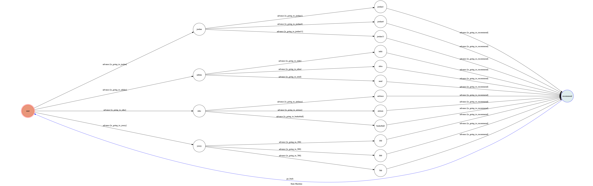

# TOC-ChatBot
Final Program for TOC class

A Facebook messenger bot based on a finite state machine

## Features
### Button
* web_url button
* postback button

### Image
* It can send image of the collection

### Web Crawler
* Use BeautifulSoup to crawl stockX website info

## Finite State Machine

## Usage
The initial state is set to `user`.

Every time `user` state is triggered to `advance` to another state, it will trigger `is_going_to_jordan` or `is_going_to_adidas` or `is_going_to_nike` or `is_going_to_yeezy`.

* user
	* Input: "air jordan"
		* Reply: 
		
		

	* Input: "adidas"
		* Reply: Is similar as input "air jordan"
		
	* Input: "nike"
		* Reply: Is similar as input "air jordan"
	
	* Input: "yeezy"
		* Reply: Is similar as input "air jordan"

* jordan
	* Input: Click the "Air Jordan1" postback button
		* Reply: 
		
		
	* Input: Click the "Air Jordan4" postback button
		* Reply: Is similar as click the "Air Jordan1" postback button
		
	* Input: Click the "Air Jordan11" postback button
		* Reply: Is similar as click the "Air Jordan1" postback button
* The state `adidas` , ` nike` , `yeezy` has the same algorithm as `jordan`

## Reference
[stockX](https://stockx.com/) 
